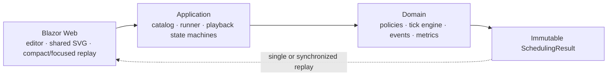

# Dispatch Lab

Dispatch Lab is a deterministic CPU-scheduling simulator and event debugger built with .NET 10, C# 14, and standalone Blazor WebAssembly. It calculates complete immutable traces first, then lets a learner replay and compare what different schedulers do at the same absolute tick.

The application models one logical CPU, integer ticks, one CPU burst per job, and no I/O. It is intentionally a teaching model rather than an operating-system emulator.

Use it to learn CPU scheduling, demonstrate policy trade-offs in an operating-systems class, or inspect a reusable C# scheduling engine. All simulation and playback run in the browser; no backend service or account is required.

**Start here:** [Run locally](#run-locally) · [First experiment](#your-first-experiment) · [Algorithms](#included-algorithms) · [Metrics](#understanding-the-results) · [Development](#verification-commands) · [Documentation](#documentation-map)

## Your first experiment

1. Start the app using the commands below. The editor opens with five jobs (`P1`–`P5`) and FCFS, SRTF, and Round Robin selected.
2. Keep the generated workload or edit arrival time, burst length, priority, and fixed MLQ class. **Load seed** regenerates the five jobs for the entered seed; **Regenerate with next seed** creates another repeatable example. Loading a seed replaces manual job edits.
3. Select one or more policies. Options appear for Round Robin, MLQ, and MLFQ when selected.
4. Click **Build 3 scheduler traces** (the count follows your selection). Validation errors remain in the setup view; a successful run opens the recorded results.
5. Click **Next shared decision** to compare every selected policy at the next recorded decision time, or **Play all** for automatic replay. Change speed between 0.5×, 1×, 2×, and 4× without changing the schedules.
6. Use **Inspect events** on an algorithm card for its complete event-by-event debugger and per-job metrics. This pauses shared playback and opens an independent inspector.
7. Choose **Edit workload and policies** to change the experiment and rebuild it. The inputs and selection are retained, but the old traces are discarded.

Selecting just one policy opens the detailed debugger directly. Its **Step** button advances one event; several events can share a timestamp. In comparison mode, stepping advances one distinct timestamp across all traces.

Experiments live in memory. Record the job values, policy options, and seed if you want to reproduce a manually edited workload later; refreshing the page loses edits. The seed reproduces generated jobs, not subsequent manual changes.

### Experiments to try

- **Preemption:** give P1 a long burst at tick 0 and let a short job arrive at tick 1. Compare FCFS, SJF, and SRTF.
- **Time slicing:** run Round Robin with quantum 1, then 4. Compare first response, waiting time, and switch count.
- **Priority:** give a later job priority 1 and compare the two priority policies. Lower numeric values mean higher priority.
- **Queue policies:** compare MLQ's fixed classes with MLFQ's dynamic demotion and periodic boosts. The editor's MLQ class does not set a job's initial MLFQ level: all MLFQ arrivals start in Q0.

## What the interface does

The setup follows an explicit sequence:

1. edit the five-job workload;
2. choose one or more scheduling policies;
3. adjust only the options required by those policies;
4. build the selected scheduler traces.

The build action appears after policy selection and is disabled when no policy is selected. A successful build collapses the long form, focuses the results, and preserves an **Edit workload and policies** route.

For a multi-policy experiment, the comparison theater provides:

- one shared playback clock and time cursor;
- one aligned SVG lane per selected algorithm on a common absolute axis;
- simultaneous compact ready-queue, CPU, completion, decision, and metric views;
- play/pause, restart, speed, and **Next shared decision** controls that affect every lane;
- an optional full event debugger for one policy without replacing the comparison;
- a metrics and trade-off table for the identical workload.

At 1440 px the compact debuggers use a two-column grid. At narrow widths they become one column, while the common timeline alone scrolls horizontally.

## Included algorithms

| Policy | Mode | Core rule |
|---|---|---|
| FCFS | Non-preemptive | Oldest ready arrival, then job ID |
| SJF | Non-preemptive | Shortest original burst among ready jobs |
| SRTF | Preemptive | Strictly shortest remaining work |
| Round Robin | Time-sliced | FIFO with configurable quantum |
| Priority NP | Non-preemptive | Lowest numeric static priority |
| Priority P | Preemptive | Preempt only for a strictly higher priority |
| HRRN | Non-preemptive | Highest `(waiting + burst) / burst` |
| MLQ | Preemptive fixed queues | Strict Q0/Q1/Q2 priority with per-queue policies |
| MLFQ | Preemptive adaptive queues | Demotion by CPU use plus periodic priority boosts |

Exact arrival ordering, tie-breaking, quantum boundaries, MLQ/MLFQ rules, event order, metrics, and resource limits are normative in [Scheduling Semantics](docs/specification/scheduling-semantics.md).

### Inputs and defaults

| Input | Meaning / valid range | Default |
|---|---|---|
| Arrival | First eligible tick, 0–10,000 | Generated per job |
| Burst | Required CPU work, 1–1,000 ticks | Generated per job |
| Priority | 1–99; 1 is highest | Generated per job |
| MLQ class | Q0 interactive, Q1 standard, Q2 background | Generated per job |
| Round Robin quantum | 1–1,000 ticks | 2 |
| MLQ Q0 / Q1 quanta | 1–1,000 ticks each; Q2 uses FCFS | 2 / 4 |
| MLFQ Q0 / Q1 / Q2 quanta | 1–1,000 ticks each | 1 / 2 / 4 |
| MLFQ boost interval | 1–100,000 ticks | 20 |

The browser editor has five fixed job rows. The reusable Domain API accepts 0–100 jobs, unique nonblank IDs of at most 20 characters, and at most 100,000 total burst ticks. Empty workloads return empty traces with zero metrics. Options are validated at the domain boundary, including options for policies not selected in a particular run.

## Understanding the results

Execution slices use half-open intervals: `[2, 5)` means three ticks of CPU work. Idle slices explicitly account for gaps. Ties generally use earlier arrival, then ordinal job ID; FIFO policies preserve their documented queue order. Equal remaining time or equal priority does not preempt the current job.

| Metric | Calculation | Interpretation |
|---|---|---|
| Turnaround | Completion − arrival | Total elapsed time in the system |
| Waiting | Turnaround − burst | Total time ready but not executing |
| Response | First start − arrival | Delay before the first CPU service |
| CPU time | Sum of a job's slice lengths | Equals the input burst |
| Makespan | Final completion time measured from tick 0 | Includes initial and intermediate idle time |
| CPU utilization | Busy ticks / makespan × 100 | Percentage of elapsed time spent executing |
| Throughput | Completed jobs / makespan | Jobs completed per abstract tick |
| Context switches | Direct hand-offs between different jobs | Excludes initial dispatch, idle transitions, and same-job quantum renewal |

Average wait, turnaround, and response are arithmetic means over the workload. Metrics and the full timeline are calculated before playback, so displayed totals describe the completed run even while the cursor is near the beginning. Context switches are counted but consume **zero simulated ticks**; real switching overhead is outside this model.

For example, FCFS with `P1(arrival=0, burst=5)`, `P2(1, 3)`, and `P3(2, 1)` produces:

```text
0          5      8  9
|    P1    |  P2  |P3|
```

Waiting times are 0, 4, and 6 ticks: average `10 / 3 ≈ 3.33`. Turnaround times are 5, 7, and 7. CPU utilization is 100%, with two context switches. This three-job API example is covered by [the golden schedule tests](tests/CpuSchedulingSimulator.Domain.Tests/GoldenScheduleTests.cs); the browser editor always presents five jobs.

## Architecture



- `CpuSchedulingSimulator.Domain` owns validated immutable models, nine scheduler strategies, the tick engine, event recording, invariants, and metrics. It has no UI or application dependency.
- `CpuSchedulingSimulator.Application` owns catalog/orchestration, deterministic sample generation, single-trace playback, and shared comparison playback.
- `CpuSchedulingSimulator.Web` is an adapter over application/domain results. Razor components render snapshots and slices; they never choose the next job.
- Three matching test projects keep domain, orchestration/playback, and rendered UI contracts independently testable.

C# source follows a deliberately navigable layout: every class or interface has its own correspondingly named file and an XML summary explaining its purpose and usage. Record and struct declarations, plus method declaration parameter lists, stay on one line so signatures remain easy to scan and search consistently. Tests follow the same conventions as production code.

The full rationale and extension analysis are in [Architecture and Test Strategy](docs/architecture/architecture-and-test-strategy.md). Technology/package choices are recorded in [TDR 0001](docs/decisions/0001-technology-decision-record.md).

## Run locally

Prerequisites: Git if cloning, a WebAssembly-capable browser, and the .NET **SDK** selected by [`global.json`](global.json). The SDK baseline is `10.0.400`, with `latestPatch` roll-forward within that feature band; `10.0.401` was used for the latest checks. A runtime-only installation is insufficient.

Clone this repository using its GitHub **Code** button or download and extract its ZIP, then open a terminal in the directory containing `CpuSchedulingSimulator.slnx`. Run:

```powershell
git clone https://github.com/AfshinZavvar/dispatch-lab.git
cd dispatch-lab
dotnet restore CpuSchedulingSimulator.slnx
dotnet run --project src/CpuSchedulingSimulator.Web
```

If you downloaded the ZIP or already cloned the repository, skip the first two commands and run restore/start from its root directory.

Use the URL printed by the development server (the default HTTP launch profile uses `http://localhost:5192`). To choose an explicit local port:

```powershell
dotnet run --project src/CpuSchedulingSimulator.Web --urls http://127.0.0.1:5178
```

No database, account, secret, external API, Node runtime, or JavaScript package install is required.

Internet access is needed for the initial NuGet restore unless dependencies are already cached. Once served and loaded, scheduling does not call a remote service. This repository does not include an offline-installable PWA or persistence layer.

## Repository layout

```text
CpuSchedulingSimulator.slnx       Six-project solution
global.json                      SDK selection
Directory.Build.props            C# 14, analyzers, nullable, warnings as errors
Directory.Build.targets          Test naming analyzer exception
Directory.Packages.props          Central NuGet package versions
.config/dotnet-tools.json         Local Stryker tool version
stryker-config.json               Mutation test scope and runner
src/
  CpuSchedulingSimulator.Domain/       Algorithms, engine, models, validation
  CpuSchedulingSimulator.Application/  Catalog, runner, seed generation, playback
  CpuSchedulingSimulator.Web/          Razor pages/components, UI state, SVG/CSS
tests/
  CpuSchedulingSimulator.Domain.Tests/
  CpuSchedulingSimulator.Application.Tests/
  CpuSchedulingSimulator.Web.Tests/
docs/
  architecture/                  Design and testing rationale
  decisions/                     Technology decision record
  planning/                      Implementation history
  specification/                 Normative scheduling behavior
```

Generated `bin/`, `obj/`, `artifacts/`, `TestResults/`, IDE state, and personal `*.user` files are excluded from Git.

## Use the engine from C#

Reference `src/CpuSchedulingSimulator.Domain/CpuSchedulingSimulator.Domain.csproj` from a .NET 10 project to run a scheduler without Blazor:

```csharp
using CpuSchedulingSimulator.Domain.Algorithms;
using CpuSchedulingSimulator.Domain.Models;

JobDefinition[] jobs =
[
    new("P1", ArrivalTime: 0, BurstTime: 5, Priority: 2, QueueLevel: 0),
    new("P2", ArrivalTime: 1, BurstTime: 2, Priority: 1, QueueLevel: 1),
];

var result = new RoundRobinAlgorithm().Schedule(
    jobs,
    new SchedulingOptions(RoundRobinQuantum: 2));

foreach (var slice in result.ExecutionSlices)
{
    Console.WriteLine($"[{slice.StartTime}, {slice.EndTime}): {slice.JobId ?? "IDLE"}");
}

Console.WriteLine($"Average waiting time: {result.Metrics.AverageWaitingTime:F2}");
```

`SchedulingResult` includes execution slices, ordered events with snapshots, per-job metrics, aggregate metrics, and the input jobs/options. Use the Application layer's `AlgorithmCatalog` and `SimulationRunner` to compare several schedulers against the same copied workload. Results produced by the engine expose read-only collections; playback navigates them without recalculating scheduling decisions.

## Verification commands

```powershell
dotnet build CpuSchedulingSimulator.slnx --no-restore
dotnet test CpuSchedulingSimulator.slnx --no-build --no-restore
dotnet format CpuSchedulingSimulator.slnx --verify-no-changes --no-restore
```

Coverage:

```powershell
dotnet test CpuSchedulingSimulator.slnx --no-build --no-restore `
  --collect:"XPlat Code Coverage" `
  --results-directory artifacts/coverage
```

Mutation testing uses the repository-local tool and [`stryker-config.json`](stryker-config.json):

```powershell
dotnet tool restore
dotnet stryker --config-file stryker-config.json `
  --output artifacts/mutation-current `
  --skip-version-check
```

The configuration targets the correctness-critical policy engine, uses the Microsoft Testing Platform path required for mutant activation with xUnit v3/.NET 10, and disables Stryker coverage optimization because its current coverage mapping incorrectly classifies exercised queue-policy mutants as uncovered. Stryker labels that runner integration preview; the full normal test suite and coverage run independently verify the same build.

Package audit:

```powershell
dotnet package list --project CpuSchedulingSimulator.slnx --include-transitive --vulnerable
dotnet package list --project CpuSchedulingSimulator.slnx --include-transitive --deprecated
dotnet package list --project CpuSchedulingSimulator.slnx --outdated
```

## Verification status

Rechecked on **2026-09-26** with **.NET SDK 10.0.401**: restore succeeded, build completed with **0 warnings and 0 errors**, all **61 tests passed** (Domain 31, Application 19, Web 11), formatting verification passed, and the Release static publish succeeded. The SDK reported that the optional `wasm-tools` workload was absent, so native WebAssembly optimizations were not applied.

Tests cover hand-calculated schedules for all nine policies, arrival/tie/quantum boundaries, idle periods, deterministic repeated runs, randomized workload invariants, validation, orchestration, playback, and rendered component behavior. Test dependencies include xUnit v3, bUnit, AutoFixture, NSubstitute, and Coverlet; versions are centralized in `Directory.Packages.props`.

### Historical quality snapshot

Verified on 2026-08-15 with .NET SDK 10.0.400 / runtime 10.0.11:

| Check | Result |
|---|---|
| Build | 0 warnings, 0 errors |
| Automated tests | 61 passed: Domain 31, Application 19, Web 11 |
| Domain coverage | 90.71% lines (752/829), 82.17% branches (166/202) |
| Application-host coverage | 61.11% lines, 49.65% branches across Application + referenced Domain |
| Web-host coverage | 67.28% lines, 57.03% branches across Web + referenced projects/generated Razor |
| Engine mutation analysis | 69.23%; 182 killed, 84 survived, 7 timed out from 273 executable mutants |
| Package audit | No known vulnerable or deprecated direct/transitive packages |
| Formatting/static analysis | `dotnet format --verify-no-changes` and warning-as-error build pass |
| Browser validation | 1440 px and 390 px layouts, focus transfer, shared step, focused inspector, no console warnings/errors |

Coverage reports are per test host and intentionally not blended: the Application and Web collectors also instrument referenced assemblies, while generated Razor lowers the Web-host percentage. Mutation survivors are primarily explanation-string changes, equivalent canonical-order changes, and defensive invariant branches that validated public entry points cannot create. The report remains evidence, not a claim of perfect testing.

The table above preserves the earlier project's recorded results. Coverage, mutation analysis, package audits, and real-browser layout checks were not rerun for the 2026-09-26 documentation update. The mutation configuration now names the individual policy files after the source split; the historical mutation score does not certify that revised scope. Run the supplied commands to obtain fresh reports. Generated reports are not committed.

## Build for static hosting

```powershell
dotnet publish src/CpuSchedulingSimulator.Web -c Release -o artifacts/publish
```

Serve the **contents of `artifacts/publish/wwwroot`** from an HTTP(S) static web host. The deployed client does not need a .NET server, although building it requires the SDK. Do not open `index.html` through a `file://` URL. Preserve `_framework` and all emitted assets, and configure the host to serve WebAssembly assets correctly.

The source assumes a site at the domain root (`<base href="/">`). For a repository subpath such as `/dispatch-lab/`, adjust the base URL in `wwwroot/index.html` before publishing and make the home link in `Layout/MainLayout.razor` relative to that base. Configure fallback routing to `index.html` for client routes as needed. If serving precompressed `.br` or `.gz` assets, the host must send the corresponding content encoding.

Pushing this repository to GitHub publishes source code only. No GitHub Pages deployment workflow or hosted demo is included.

## Troubleshooting

| Symptom | What to check |
|---|---|
| SDK not found or unsupported target framework | Run `dotnet --list-sdks`; install an SDK allowed by `global.json` and run commands from the repository root. |
| Restore cannot reach packages | Check network/proxy access to your configured NuGet sources and read access to your NuGet configuration; rerun `dotnet restore`. |
| Local port is already in use | Use the explicit `--urls` example with another available port. |
| HTTPS certificate error | Use the HTTP launch profile for local development, or configure a trusted development certificate. |
| Build traces button is disabled | Select at least one policy. |
| Validation error after editing | Use integer values within the input ranges above; a burst or quantum cannot be zero. |
| Several steps show the same tick | The single-policy debugger steps events, including arrivals, queue changes, and dispatches at the same timestamp. |
| Blank page or missing assets after deployment | Serve the published `wwwroot` over HTTP(S), check the base path and browser network errors, and verify `_framework` assets are present. |
| Reset does not restore quantum settings | The current **Reset all inputs** action reloads the default seed and default policy selection but retains quantum/boost values. Restore those options manually or reload the page. |

## Security posture

- Domain validation bounds job counts, text length, time/burst/priority/queue values, quanta, boost intervals, and total work.
- The client has no authentication, persistence, cookies, uploads, secrets, or remote service calls.
- User values use normal Razor encoding; the source contains no `MarkupString`, `innerHTML`, dynamic script generation, or user-controlled URL/CSS rendering.
- Scheduling totals use bounded and checked arithmetic where overflow is plausible.
- Reproducible `System.Random(seed)` data is sample generation only, never security-sensitive randomness.
- Production projects depend only on the .NET/ASP.NET framework and the WebAssembly hosting packages.

A hosting platform should add its own deployment headers, including an appropriate Content Security Policy; a static client cannot enforce server response headers by itself.

## Add another scheduler

1. add a stable `SchedulingAlgorithmId` and metadata;
2. implement `ICpuSchedulingAlgorithm`, normally by composing the shared tick engine with a policy;
3. keep the algorithm and its policy in separate, correspondingly named files with XML purpose/usage summaries, then register it in `Program.cs` and the test catalog;
4. add a hand-calculated golden scenario, boundary tests, shared invariants, and mutation coverage;
5. update the algorithm table and normative semantics.

Existing schedulers, playback state machines, comparison lanes, and metrics components do not need modification beyond the deliberate identifier/catalog registration points.

A policy that introduces new inputs also needs matching domain validation and UI controls: the current options panel explicitly handles Round Robin, MLQ, and MLFQ. Algorithm metadata does not currently provide a generic option-schema renderer.

## Contributing

For a bug report, include the algorithm, complete job values, all relevant options, expected versus actual slices/metrics, and reproduction steps. Include the seed for generated workloads, but also include any manual edits.

For changes, keep scheduling decisions in Domain and replay orchestration in Application. Add an independently calculated regression example for scheduling changes, preserve deterministic tie-breaking, and update the semantics document when behavior changes. Run build, tests, and formatting verification before submitting a pull request. Avoid committing generated reports or IDE-specific files.

## License

No license file has been added to this repository. It does not currently declare an open-source license.

## Known model limits

- one logical CPU and one CPU burst per job;
- no I/O blocking, context-switch cost, deadlines, multicore behavior, or process creation;
- integer ticks and bounded workloads rather than production-scale event heaps;
- three fixed MLQ classes and one documented three-level MLFQ variant;
- no live editing after calculation—select **Edit workload and policies**, then rebuild immutable traces;
- metrics describe this workload only; the interface intentionally avoids declaring a universally best algorithm.

## Documentation map

- [Technology Decision Record](docs/decisions/0001-technology-decision-record.md)
- [Scheduling Semantics](docs/specification/scheduling-semantics.md)
- [Architecture and Test Strategy](docs/architecture/architecture-and-test-strategy.md)
- [Phased Implementation Plan](docs/planning/implementation-plan.md)
