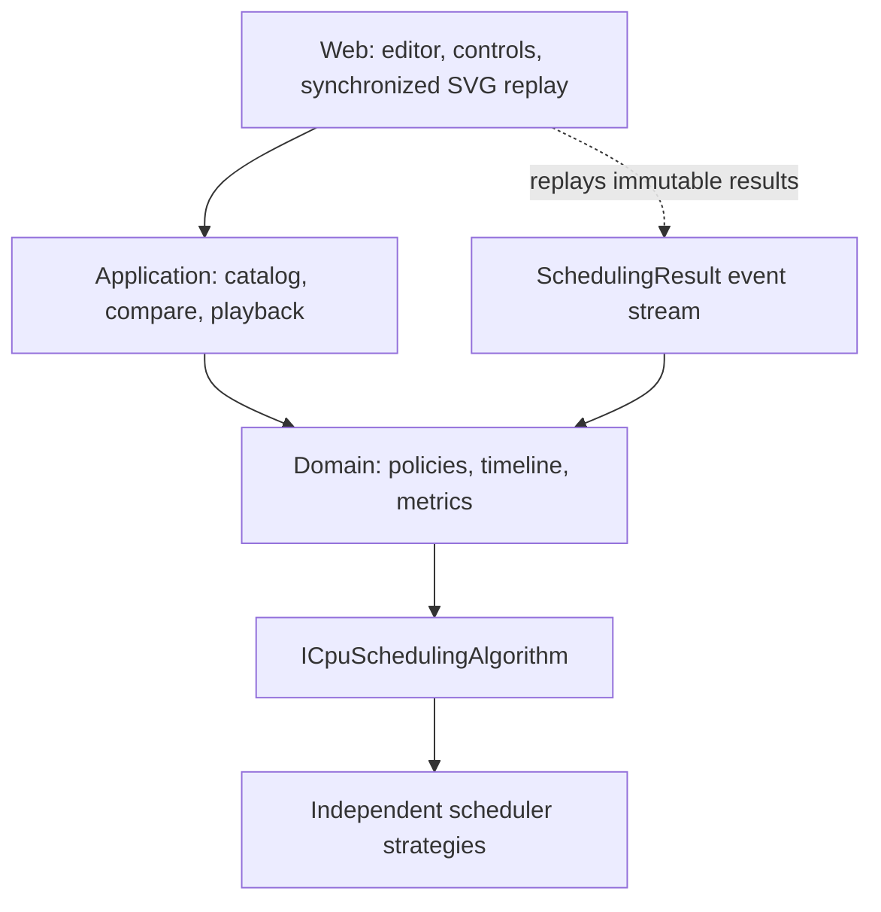

# Architecture and Test Strategy

Status: Implemented and verified  
Last updated: 2026-08-15

## Solution shape

```text
CpuSchedulingSimulator.slnx

src/
  CpuSchedulingSimulator.Domain/
  CpuSchedulingSimulator.Application/
  CpuSchedulingSimulator.Web/

tests/
  CpuSchedulingSimulator.Domain.Tests/
  CpuSchedulingSimulator.Application.Tests/
  CpuSchedulingSimulator.Web.Tests/
```

Three production projects are justified:

- **Domain** owns immutable jobs/options/results, validation, scheduler strategies, timeline recording, explanations, and metrics. It references no UI or application project and can run in a console, service, or test host.
- **Application** owns use-case orchestration: the algorithm catalog, same-dataset multi-algorithm simulation, deterministic sample generation, and the replay state machine. It depends only on Domain.
- **Web** owns Razor components, user input state, SVG/CSS rendering, accessibility, and timer-driven playback. It depends on Application and Domain types exposed by application results. It contains no scheduling decisions.

The test projects mirror only boundaries with materially different responsibilities. This is lighter than introducing repositories, mediator handlers, persistence, or transport layers that the product does not need.



Dependency tests and project references enforce `Web → Application → Domain`; Domain cannot reference Application/Web, and cycles are prohibited.

## Principal domain design

- `JobDefinition`, `SchedulingOptions`, `SchedulingAlgorithmId`, `SchedulingResult`, `ExecutionSlice`, `JobMetrics`, `SimulationEvent`, `SchedulerSnapshot`, and `AlgorithmMetrics` are immutable records or value-oriented types.
- `ICpuSchedulingAlgorithm` is the extension seam. Each strategy exposes stable metadata and a `Schedule` operation. A strategy owns selection semantics, while shared validation, event recording, slice accounting, and metric calculation remain composed services/internal collaborators.
- `SimulationRecorder` is a per-call mutable implementation detail that records transitions and freezes the final immutable result. No static mutable state exists.
- `SchedulingResultFactory` validates recorder output and calculates all metrics once. The UI never recalculates them.
- Strategy instances are stateless and safe to register as singletons; all simulation state is local to `Schedule`.

An algorithm identifier is a stable enum/value, not a display string. Metadata provides the UI name, description, preemptive flag, and option requirements without a giant UI switch.

## Source organization conventions

- Every class or interface lives in its own correspondingly named `.cs` file. Algorithm adapters and their internal engine policies remain separate because they have different extension and lifecycle responsibilities.
- Every class and interface has an XML `<summary>` that states its purpose and, where useful, how or where it should be used. Records and enums are documented to the same standard so immutable contracts remain self-explanatory.
- Struct and record declarations use a single line. Method declaration parameter lists also stay on one line, including test helpers; invocation arguments may still use multiple lines when that makes data setup or control flow clearer.
- Production and test projects follow the same rules. This keeps navigation predictable and avoids treating tests as second-class source code.

## Application design

- `AlgorithmCatalog` maps identifiers to registered strategies and detects missing/duplicate registrations at startup.
- `SimulationRunner` validates the request once, invokes each selected strategy against the same immutable job array, and returns results in requested order.
- `SeededJobGenerator` accepts an explicit integer seed. Its output is deliberately shaped to include staggered/simultaneous arrivals, varied bursts/priorities, and queue levels; the same seed always produces the same five jobs.
- `SimulationPlayback` is a synchronous state machine over one immutable event list: restart, step, play, pause, and speed changes. It powers single-algorithm runs and the optional focused debugger.
- `ComparisonPlayback` owns one absolute clock over two or more immutable results. It derives each lane's current event, snapshot, running job, and remaining work at that clock. “Next shared decision” advances to the next timestamp present in the union of all selected event streams. It never reruns or mutates a scheduler.
- Browser timers advance only a playback state machine. Playback speed and pauses therefore cannot affect any execution slice, event, or metric.

## Web and animation state

The page is a single teaching workbench:

```text
SETUP
  01 Workload → 02 Policies → 03 Options → 04 Build traces
                                          ↓
COMPARISON
  experiment summary → shared controls + absolute clock
                     → common SVG time axis, one algorithm per lane
                     → 2-column compact ready/CPU/done debugger grid
                     → metrics and trade-off table
                     → optional single-policy detailed event inspector
```

The trace-building action is deliberately placed after policy selection, not in the options sidebar beside the first setup step. It is disabled when no policy is selected. A successful build collapses the long setup form, focuses the comparison heading, and shows a compact experiment summary with an explicit route back to editing.

For one selected algorithm, the full event debugger remains the primary result. For multiple algorithms, all selected schedules appear together: one global clock, one shared absolute time axis, one lane per algorithm, and a responsive grid of compact ready/CPU/completed machines. Algorithms may have different event boundaries, so stepping uses the ordered union of their event timestamps; each card displays the latest snapshot at or before the shared time. “Inspect events” pauses comparison playback and opens the existing full debugger for one policy without hiding the other lanes.

### Visual direction

Subject: a CPU scheduling laboratory for computing students. The page's single job is to make each dispatch decision inspectable.

- **Palette:** Blueprint `#10233D`, Paper `#F4F7FA`, Signal cyan `#18A6B8`, Execution amber `#F2B84B`, Completion green `#31866B`, Interrupt coral `#D85C55`. Status always has text/icons in addition to color.
- **Type:** system `Segoe UI Variable` for instructional prose and controls; `Cascadia Mono` for ticks, IDs, queues, and metrics. This uses the visual language of an operating-system debugger without downloading fonts.
- **Layout:** asymmetric setup instrument panel followed by a full-width comparison theater; dense but not cramped. Four selected policies form a 2×2 debugger matrix on desktop and one column on narrow screens.
- **Signatures:** the focused debugger retains the **dispatch rail**, where ready jobs cross a marked gate into the CPU chamber. The comparison theater adds a **shared execution axis** with aligned policy swimlanes and a single coral time cursor.

Self-critique changed the initial idea from a generic dark dashboard to a light lab-instrument surface with a dark CPU chamber. The contrast puts visual emphasis on the running transition while keeping tables and form inputs readable for extended study.

Motion uses short CSS transitions for queue/CPU state and a moving dispatch marker. `prefers-reduced-motion: reduce` disables transitions. Step mode and explicit status text preserve the entire explanation without motion. Controls are native buttons/inputs with visible focus, labels, and keyboard operation.

## Security design

- The WebAssembly client has no database, authentication, cookies, secrets, uploads, remote calls, or raw HTML rendering.
- All job/configuration values are parsed into bounded typed models before scheduling. Domain validation is authoritative even if browser attributes are bypassed.
- Job IDs are rendered through normal Razor interpolation. `MarkupString`, `innerHTML`, dynamic script generation, and user-provided CSS/URLs are prohibited.
- Work and event counts are bounded; arithmetic uses `checked` where totals can overflow.
- Seeded randomness uses `System.Random(seed)` only for reproducible examples, never for security.
- Content Security Policy can be tightened by a host, but the standalone static application avoids claiming server headers it does not control.

## Automated test strategy

### Domain tests

- Hand-calculated golden scenarios for each algorithm assert complete slices and per-job metrics.
- Focused behavioral tests cover the required arrival, tie, idle, preemption, quantum, fixed-queue, boost, and completion cases.
- Shared invariant tests run every algorithm against curated edge cases and deterministic randomized cases. Expected values are invariants only; golden expected schedules are never generated by production code.
- Validation tests cover all bounds and checked totals.
- Directly instantiate pure schedulers; no mocks.

### Application tests

- Verify one/multiple algorithm orchestration, same dataset use, ordering, duplicate selections, deterministic generation, single playback transitions, shared comparison transitions, union decision stepping, per-result snapshots, and synchronized remaining-time projection.
- Use NSubstitute only for the genuine scheduler/catalog boundary when verifying orchestration calls.
- Use AutoFixture only for irrelevant valid values; use explicit jobs whenever output matters.

### Web component tests

- bUnit renders the job editor, algorithm selector, build workflow, playback controls, ready queue, CPU/completed state, explanation, SVG timelines, compact comparison cards, focused inspector, and metrics table.
- Tests lock the build action after policy selection and outside the options panel; successful setup collapse; one lane/card per selected policy; absence of result tabs; shared stepping; edit restoration; and validation behavior.
- Tests invoke control events and assert accessible state/text/attributes. CSS animation frames and browser layout pixels are not unit-tested. A real-browser smoke pass separately checks the 1440 px two-column and 390 px one-column layouts, internal timeline overflow, focus transfer, interactions, and console health.

## Golden scenario policy

Golden scenarios live as readable test data beside their independent calculations. Each contains input, exact execution slices, completion, wait, response, and turnaround values. A review comment explains manual arithmetic. Production schedulers are never called to construct expected data.

## Coverage and mutation quality gates

- Cobertura collection passes with Domain at 90.71% line and 82.17% branch coverage. Application/Web host reports are kept separate because they also instrument referenced assemblies and generated Razor code.
- The historical Stryker run targeted five correctness-critical policy/engine/result files. Its .NET 10/xUnit v3 coverage mapping misclassified executed queue policies, so the checked-in configuration uses the MTP runner with coverage optimization disabled. That run killed 182 of 273 executable mutants, with 84 survivors and 7 timeouts: 69.23%. On 2026-09-26, the scope was updated to the individual policy files after the source split; the historical score has not been reverified for that revised scope.
- The initial 59.34% run exposed meaningful missing assertions for aggregate metrics, event start/resume transitions, exact MLQ quanta, MLFQ higher-queue preemption, and lowest-queue rotation. Adding those contracts raised the score by 9.89 points.
- Remaining survivors are reviewed categories: explanation-string variants, equivalent changes masked by canonical input ordering, and defensive invariant branches that validated public entry points cannot construct. No 100% coverage or mutation claim is made.

## Extensibility proof: Lottery scheduling

Adding `LotterySchedulingAlgorithm` requires:

1. add its algorithm ID and metadata;
2. implement `ICpuSchedulingAlgorithm`, using a seeded option and the shared recorder/result factory, with the adapter and any policy in separate documented files;
3. register the strategy in application composition;
4. add explicit seeded golden tests and generic invariant coverage.

The editor renders algorithm descriptions supplied by metadata, but its option controls are explicitly implemented for Round Robin, MLQ, and MLFQ. Lottery's new ticket/seed inputs would require domain models/validation and corresponding editor controls. No existing scheduler strategy needs to change; identifier/catalog additions remain explicit registration points.

## Architecture risks and mitigations

- **Tick-based algorithms can be slower than event heaps:** bounded to 100,000 total CPU ticks; clarity and invariant checking are more important here.
- **Rich event snapshots allocate memory:** event recording occurs only at meaningful boundaries, not every animation frame; bounds cap worst-case work.
- **MLFQ has many legitimate variants:** exact release semantics are versioned in the specification and displayed in the UI.
- **UI could accidentally infer state:** components accept `SimulationEvent`/`SchedulingResult` snapshots; tests ensure displayed queue and running job come directly from them.
- **A common clock can land between an algorithm's own events:** `ComparisonPlayback` intentionally uses the latest immutable snapshot at or before the absolute tick and derives the running slice from half-open execution intervals. This rule is specified and directly tested.
- **Many selected algorithms increase vertical density:** timelines stay aligned on one horizontally scrollable axis; compact machines use a two-column desktop grid and a single narrow-screen column. Full event detail is opt-in rather than repeated nine times.
